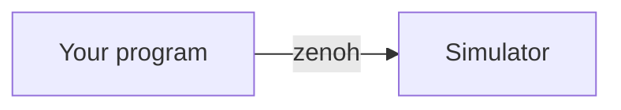

# Style guide for the VRobots SDK Book

This is a contract, not a suggestion. Every page obeys it. If you are an agent
drafting a chapter, read this file completely before writing a single line, and
re-read the "Hard rules" section before you finish.

The book this one replaces failed for structural reasons, not stylistic ones:
two pages carried the same H1, code blocks appeared with no lead-in and no
expected output, reference data was buried in prose, and nothing linked to
anything. Every rule below prevents one of those.

---

## 1. Page template

Every page, without exception:

```markdown
# Sentence case title

One sentence saying what this page is for. No heading between the H1 and this line.

## First section

...

**Next:** [Title of the next page](../chNN-dir/NN-file.md)

**See also:** [Page](../path.md), [Page](../path.md)
```

Rules:

- Exactly one `#` H1 per page. It must match its `book/src/SUMMARY.md` entry **character
  for character**.
- Sentence case for every heading. Not Title Case, not lowercase-with-hyphens.
- `##` for sections. `###` only where a section genuinely nests. **Never `####`.**
- The purpose line is one sentence, present tense, and says what the reader gets.
- `**Next:**` and `**See also:**` are the last two lines of every page. The last page
  of a chapter points at the next chapter's `00-intro.md`.

## 2. Length

A page is 60 to 200 lines of Markdown. If it is longer, it is two pages; if it is
shorter than about 40, it belongs inside its neighbour. Reference tables do not
count against this.

## 3. Code

Code blocks are written inline, as plain fenced ```` ```rust ```` blocks. There is no
build step and no include mechanism: this is a folder of Markdown files.

That puts the burden on you. **Every Rust block must be copied verbatim from a real
file under `examples/rust/src/bin/`, or be a signature copied from the SDK source.**
Never write a program you have not read. Never adapt an example "for clarity"; if the
real one is unclear, quote a smaller piece of it.

Name the file the code came from immediately above the block:

````markdown
From `examples/rust/src/bin/ex01_hello_states.rs`:

```rust
loop {
    let s = robot.states();
    ...
}
```
````

Around every block:

1. **One sentence before it** naming what to look at. Not "here is the code".
2. **A `text` block after it** with the expected output. If output is not applicable,
   say in one sentence what happens instead.

Runnable pages put the exact command in a `sh` block directly after the purpose line:

````markdown
```sh
cargo run -p vrobots-examples --bin ex01_hello_states
```
````

Do not edit anything under `examples/`. If an example does not contain the code a page
needs, say so in your report rather than inventing it.

## 4. Callouts

Four kinds, blockquote plus bold label, no preprocessor:

```markdown
> **Note.** Neutral clarification a careful reader would want.

> **Gotcha.** Behaves correctly and still surprises people. Say how to detect it.

> **Sim bug.** Broken in the simulator. Name the version and link the "Known simulator issues" page (`ch07-robots/07-known-issues.md`).

> **Not yet.** On the wire but not acted on by any robot type today.
```

Do not invent a fifth kind. Do not use emoji as structure. Do not stack two
callouts back to back; merge them or separate them with prose.

## 5. Tables

Reference data goes in a table, never in a prose list. Any table describing fields
carries units and defaults as their own columns:

| Field | Type | Units | Default | Notes |
|---|---|---|---|---|

Ranges, clamps and "what the simulator silently substitutes" belong in the Notes
column, because that is the information people come back for.

## 6. Diagrams

Mermaid in a fenced block. GitHub renders these natively, so nothing needs installing:

````markdown

````

Use a diagram only when it shows ordering, causality, a state machine, or a
namespace tree: something a table cannot express. Do not draw a diagram of a list.
Do not add diagrams beyond the ones assigned to your pages without saying so in your
report.

Keep node labels short. Diagrams must read in both light and dark themes, so never
rely on colour alone to carry meaning.

## 7. Links

- Internal links are relative paths to the `.md` file, never to the built `.html`.
- Link a term to the glossary on first use in a chapter, not on every use.
- Link forward freely. A page that raises a question it does not answer must link
  to the page that does.
- Never link to the old Python book.

## 8. Voice

- Second person, present tense, active. "You read the snapshot", not "the snapshot
  is read".
- Say what happens, then why. Never why-first.
- No colloquialisms, no exclamation marks, no rhetorical questions as headings.
- Never use an em dash. Use a comma, a colon, parentheses, or two sentences.
- Define a term on first use. After that, use it without re-explaining.
- Do not write "simply", "just", "obviously", or "of course".

## 9. Naming and files

- Directories: `book/src/chNN-slug/`. Files: `NN-slug.md`. Filesystem order equals
  reading order. The index is `book/src/SUMMARY.md`.
- Image and asset files live beside the page that uses them.

## 10. Hard rules

1. **Never edit `book/src/SUMMARY.md` while drafting a chapter.** It is the table of
   contents, authored once, and it is the reason parallel drafting does not conflict.
2. **Never edit anything under `examples/`, `crates/`, or another chapter's
   directory.**
3. **Never state an API fact that is not in your chapter's fact sheet or directly
   verifiable in the SDK's public API and examples.** The fact sheets are kept by
   the maintainers outside this repository. If you need a fact you cannot verify,
   write the sentence you would have written, mark it `<!-- VERIFY: ... -->`, and
   list it in your final report.
4. **Never invent numbers.** No made-up default masses, rates, ranges or catalog
   entries. An unknown default is "not documented", not a guess.
5. **Every claim about simulator behaviour is traceable.** If it did not come from
   the fact sheet, record where it came from (the maintainers' notes, an example
   doc comment, or a live check against the simulator) so a reviewer can follow it.
